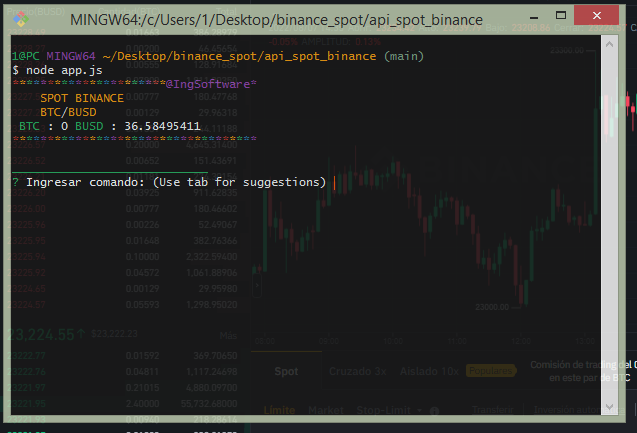
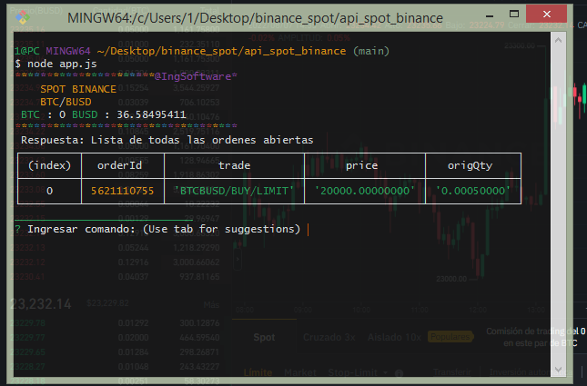
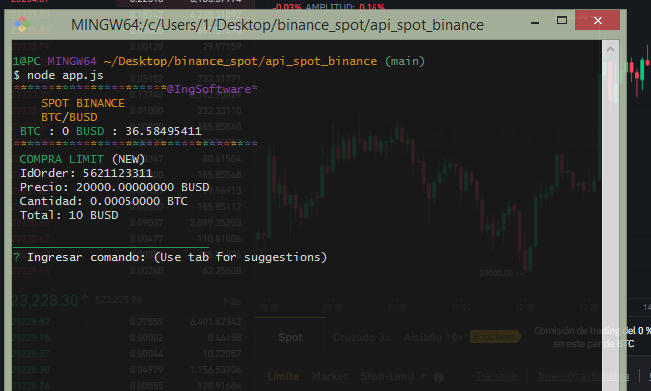
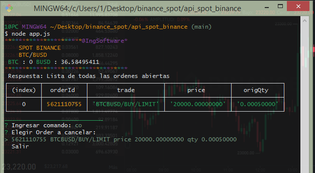

# Binance API (Spot Trading)

Programa de consola usando la API de Binance, session de Spot
ver historial de comandos con tecla tab

En el archivo .env , se guarda la API KEY y SECRET KEY

# Lista de comandos

-a cantidadComprar 
  Realiza compra market, con cantidad dada *

- d cantidadCompra precioLimiteCompra
  Compra limit con candidad de compra *

3) s cantidadVenta
 venta market con cantidad dada *

4) f cantidadVenta precioLimiteVenta
 venta limite con cantidad de venta

5) op
  Lista de ordenes abiertas

6) c
  cancelar todas las ordenes del par de trade

7) co
 cancelar una orden

8) q
  Cambiar de Par de trading

9) .
  Ver lista de comandos

10) cl
  Limpiar consola

11) b
 actualiza balance
# Comandos solo para el par BTC/USDT BTC/BUSD o cualquier stablecoin (5 decimales campo cantidad)

1) w
  Compra market usando todo el saldo en spot

2) e
  Venta market usando toda la cantidad disponible
         
3) r precioLimiteVenta
  - realiza compra market con todo el saldo en spot,
  - Despues crea una orden limite de venta con el precio dado con la misma cantidad comprada

4) t cantidadAGastar precioLimiteVenta
  - compra con cantidad de activos a gastar a precio de  mercado
  - crea orden limite de venta con el precio dado y cantidad comprada

